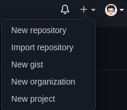
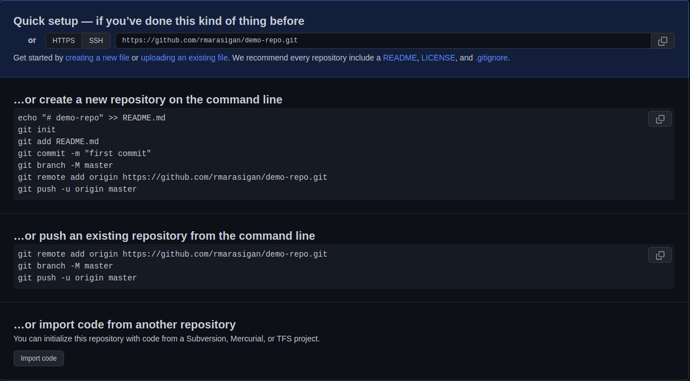
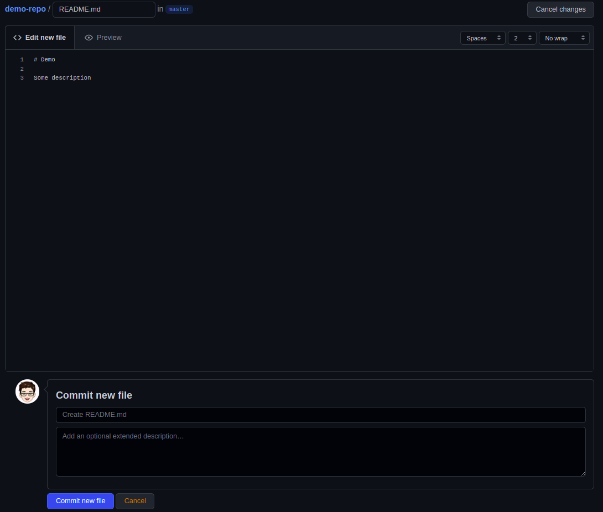
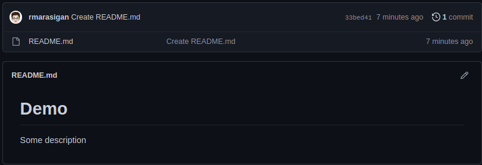
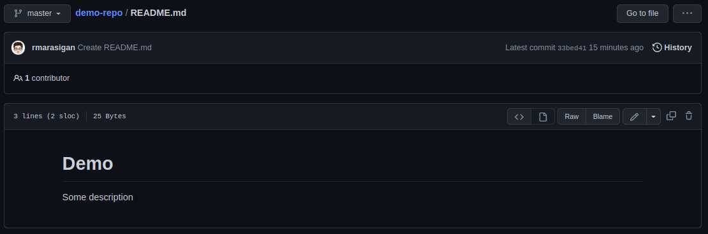
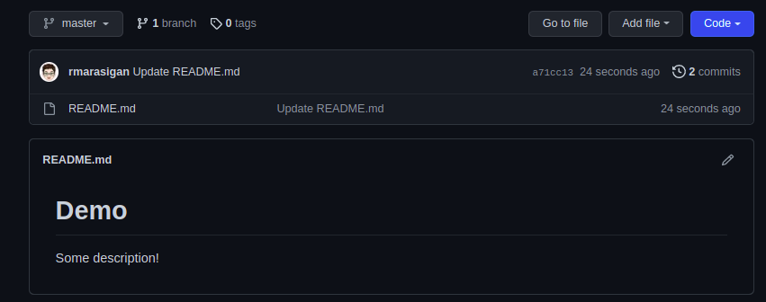

# Create and Initialize a Project

### Create a repository
You can click on the **`+`** symbol in the top right corner of the page and then choose **New repository**. Give your repo a name, then scroll down and click on "**Create repository**".

Now, you can create your files and folders for this repository locally on your machine or you can create them straight in the online editor on the Github website.

So we are going to create a simple basic Markdown file called **`README`**, this is the most basic file that you'll find in almost every project that contains almost text to describe what the project is about, what it does, and any other relevant information. So click **`creating a new file`** and name it **`README.md`**. *`md`* for Markdown.

Markdown is an easy way to format your text in these sorts of files. Please try to add some text to the `README.md` file and see what happens after clicking **Commit new file**.

The "**Create README.md**" is a placeholder text, but if you don't write anything else and commit it directly, it will use that text as the default. As you can see here, there is the commit message from when we saved this README.md file. Now you can see the README file, which because it is named README.md is the default file that Github always shows down here.

We can also go into the file, which is the same thing, except with a few different options. You'll see that we have this **Edit this file** option. Let's try and simply change the "Some description" to "Some description!".

Once you have finally updated the text, the default text placeholder instead of *Create README.md* is now **Update README.md**. So "**Commit changes**", and by committing, we saved the changes here. If we go to the *demo-repo*, it will show the last commit message as *Update README.md*. If we want to see the entire history of changes, in other words, every commit that we've made, we can click on **commits** on the upper left side. Each commit has a unique identifier.

## Reference
* [Markdown Cheat Sheet](https://www.markdownguide.org/cheat-sheet/)