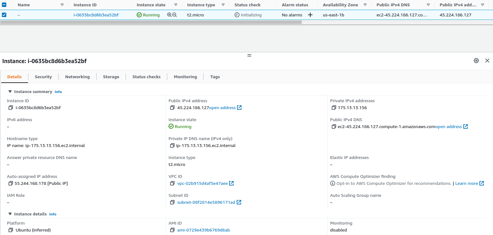
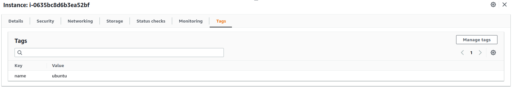

# AWS EC2 Instance

### `terraform init`
It is going to look at our configuration in all of our Terraform (`.tf`) files, which are anything that starts with `.tf`, and it is going to look for all of the providers that we have defined. Right now, we have one provider. So it is going to see that we have a provider, AWS, and it is going to download the necessary plugins to interact with the AWS API.

```bash
dev@dev:~$ terraform init

Initializing the backend...

Initializing provider plugins...
- Finding latest version of hashicorp/aws...
- Installing hashicorp/aws v4.25.0...
- Installed hashicorp/aws v4.25.0 (signed by HashiCorp)

Terraform has created a lock file .terraform.lock.hcl to record the provider
selections it made above. Include this file in your version control repository
so that Terraform can guarantee to make the same selections by default when
you run "terraform init" in the future.

Terraform has been successfully initialized!

You may now begin working with Terraform. Try running "terraform plan" to see
any changes that are required for your infrastructure. All Terraform commands
should now work.

If you ever set or change modules or backend configuration for Terraform,
rerun this command to reinitialize your working directory. If you forget, other
commands will detect it and remind you to do so if necessary.
```

So we can see that it is initializing the backend and initializing the different provider plugins, and then it is downloading the plugin for AWS. If you decided to add another provider like Azure, then it would not only download the code for AWS, but it would also download it for Azure.

You should see that Terraform has been successfully initialized, if you see some other kind of error, then you may have to do a little bit of troubleshooting, but make sure you see that the `Terraform has been successfully initialized`.

### `terraform plan`
It somewhat does a dry run of your code so you can see all the changes that will take place. It will kind of show you if it is going to delete any instances, if it is going to create new instances, or if it is going to modify instances. So it will just do a dry run so that you can make sure that you're not accidentally about to break your production network or something like that. It will just be like a quick sanity check so that you can gloss over the changes that will be made.

```bash
dev@dev:~$ terraform plan

Terraform used the selected providers to generate the following execution plan. Resource actions are indicated with the following symbols:
  + create

Terraform will perform the following actions:

  # aws_instance.web_server will be created
  + resource "aws_instance" "web_server" {
      + ami                                  = "ami-0729e439b6769d6ab"
      + arn                                  = (known after apply)
      + associate_public_ip_address          = (known after apply)
      + availability_zone                    = (known after apply)
      + cpu_core_count                       = (known after apply)
      + cpu_threads_per_core                 = (known after apply)
      + disable_api_stop                     = (known after apply)
      + disable_api_termination              = (known after apply)
      + ebs_optimized                        = (known after apply)
      + get_password_data                    = false
      + host_id                              = (known after apply)
      + id                                   = (known after apply)
      + instance_initiated_shutdown_behavior = (known after apply)
      + instance_state                       = (known after apply)
      + instance_type                        = "t2.micro"
      + ipv6_address_count                   = (known after apply)
      + ipv6_addresses                       = (known after apply)
      + key_name                             = (known after apply)
      + monitoring                           = (known after apply)
      + outpost_arn                          = (known after apply)
      + password_data                        = (known after apply)
      + placement_group                      = (known after apply)
      + placement_partition_number           = (known after apply)
      + primary_network_interface_id         = (known after apply)
      + private_dns                          = (known after apply)
      + private_ip                           = (known after apply)
      + public_dns                           = (known after apply)
      + public_ip                            = (known after apply)
      + secondary_private_ips                = (known after apply)
      + security_groups                      = (known after apply)
      + source_dest_check                    = true
      + subnet_id                            = (known after apply)
      + tags_all                             = (known after apply)
      + tenancy                              = (known after apply)
      + user_data                            = (known after apply)
      + user_data_base64                     = (known after apply)
      + user_data_replace_on_change          = false
      + vpc_security_group_ids               = (known after apply)

      + capacity_reservation_specification {
          + capacity_reservation_preference = (known after apply)

          + capacity_reservation_target {
              + capacity_reservation_id                 = (known after apply)
              + capacity_reservation_resource_group_arn = (known after apply)
            }
        }

      + ebs_block_device {
          + delete_on_termination = (known after apply)
          + device_name           = (known after apply)
          + encrypted             = (known after apply)
          + iops                  = (known after apply)
          + kms_key_id            = (known after apply)
          + snapshot_id           = (known after apply)
          + tags                  = (known after apply)
          + throughput            = (known after apply)
          + volume_id             = (known after apply)
          + volume_size           = (known after apply)
          + volume_type           = (known after apply)
        }

      + enclave_options {
          + enabled = (known after apply)
        }

      + ephemeral_block_device {
          + device_name  = (known after apply)
          + no_device    = (known after apply)
          + virtual_name = (known after apply)
        }

      + maintenance_options {
          + auto_recovery = (known after apply)
        }

      + metadata_options {
          + http_endpoint               = (known after apply)
          + http_put_response_hop_limit = (known after apply)
          + http_tokens                 = (known after apply)
          + instance_metadata_tags      = (known after apply)
        }

      + network_interface {
          + delete_on_termination = (known after apply)
          + device_index          = (known after apply)
          + network_card_index    = (known after apply)
          + network_interface_id  = (known after apply)
        }

      + private_dns_name_options {
          + enable_resource_name_dns_a_record    = (known after apply)
          + enable_resource_name_dns_aaaa_record = (known after apply)
          + hostname_type                        = (known after apply)
        }

      + root_block_device {
          + delete_on_termination = (known after apply)
          + device_name           = (known after apply)
          + encrypted             = (known after apply)
          + iops                  = (known after apply)
          + kms_key_id            = (known after apply)
          + tags                  = (known after apply)
          + throughput            = (known after apply)
          + volume_id             = (known after apply)
          + volume_size           = (known after apply)
          + volume_type           = (known after apply)
        }
    }

Plan: 1 to add, 0 to change, 0 to destroy.

─────────────────────────────────────────────────────────────────────────────────────────────────────────────────────────────────────────────────────

Note: You didn't use the -out option to save this plan, so Terraform can't guarantee to take exactly these actions if you run "terraform apply" now.
```

This may take a little while depending on how much code you've written. We just have one instance so you should see that it should be minimal output, it should be fairly quick. You'll see that it is going to color code things depending on the action. So if you see a plus (`+`) and is usually color *green*, that means it is going to create resources. If you see a minus (`-`), and it is usually the color *red*, it is going to delete a resource. If you see something *orange* with a tilde (`~`), that means that it is going to modify a pre-existing resource. 

Right now, we're going to be creating an AWS instance, an EC2 instance, and you'll see that we're using the `ami-0729e439b6769d6ab` and some details that are not known at this point. So it will be known only once we deploy it to the AWS because we won't know the ID that AWS gives it until we deploy it.

### `terraform apply`
You'll see that `terraform apply` will do something similar to `terraform plan` where it will actually take a look at your code and then figure out the changes that will take place. So this is just another security check. You can just verify that you're not going to break anything. It is going to ask you, **Do you want to perform these actions?**, so to approve them, enter *yes*. And it is going to run your code now.

```bash
dev@dev:~$ terraform apply

Terraform used the selected providers to generate the following execution plan. Resource actions are indicated with the following symbols:
  + create

Terraform will perform the following actions:

  # aws_instance.web_server will be created
  + resource "aws_instance" "web_server" {
      + ami                                  = "ami-0729e439b6769d6ab"
      + arn                                  = (known after apply)
      + associate_public_ip_address          = (known after apply)
      + availability_zone                    = (known after apply)
      + cpu_core_count                       = (known after apply)
      + cpu_threads_per_core                 = (known after apply)
      + disable_api_stop                     = (known after apply)
      + disable_api_termination              = (known after apply)
      + ebs_optimized                        = (known after apply)
      + get_password_data                    = false
      + host_id                              = (known after apply)
      + id                                   = (known after apply)
      + instance_initiated_shutdown_behavior = (known after apply)
      + instance_state                       = (known after apply)
      + instance_type                        = "t2.micro"
      + ipv6_address_count                   = (known after apply)
      + ipv6_addresses                       = (known after apply)
      + key_name                             = (known after apply)
      + monitoring                           = (known after apply)
      + outpost_arn                          = (known after apply)
      + password_data                        = (known after apply)
      + placement_group                      = (known after apply)
      + placement_partition_number           = (known after apply)
      + primary_network_interface_id         = (known after apply)
      + private_dns                          = (known after apply)
      + private_ip                           = (known after apply)
      + public_dns                           = (known after apply)
      + public_ip                            = (known after apply)
      + secondary_private_ips                = (known after apply)
      + security_groups                      = (known after apply)
      + source_dest_check                    = true
      + subnet_id                            = (known after apply)
      + tags_all                             = (known after apply)
      + tenancy                              = (known after apply)
      + user_data                            = (known after apply)
      + user_data_base64                     = (known after apply)
      + user_data_replace_on_change          = false
      + vpc_security_group_ids               = (known after apply)

      + capacity_reservation_specification {
          + capacity_reservation_preference = (known after apply)

          + capacity_reservation_target {
              + capacity_reservation_id                 = (known after apply)
              + capacity_reservation_resource_group_arn = (known after apply)
            }
        }

      + ebs_block_device {
          + delete_on_termination = (known after apply)
          + device_name           = (known after apply)
          + encrypted             = (known after apply)
          + iops                  = (known after apply)
          + kms_key_id            = (known after apply)
          + snapshot_id           = (known after apply)
          + tags                  = (known after apply)
          + throughput            = (known after apply)
          + volume_id             = (known after apply)
          + volume_size           = (known after apply)
          + volume_type           = (known after apply)
        }

      + enclave_options {
          + enabled = (known after apply)
        }

      + ephemeral_block_device {
          + device_name  = (known after apply)
          + no_device    = (known after apply)
          + virtual_name = (known after apply)
        }

      + maintenance_options {
          + auto_recovery = (known after apply)
        }

      + metadata_options {
          + http_endpoint               = (known after apply)
          + http_put_response_hop_limit = (known after apply)
          + http_tokens                 = (known after apply)
          + instance_metadata_tags      = (known after apply)
        }

      + network_interface {
          + delete_on_termination = (known after apply)
          + device_index          = (known after apply)
          + network_card_index    = (known after apply)
          + network_interface_id  = (known after apply)
        }

      + private_dns_name_options {
          + enable_resource_name_dns_a_record    = (known after apply)
          + enable_resource_name_dns_aaaa_record = (known after apply)
          + hostname_type                        = (known after apply)
        }

      + root_block_device {
          + delete_on_termination = (known after apply)
          + device_name           = (known after apply)
          + encrypted             = (known after apply)
          + iops                  = (known after apply)
          + kms_key_id            = (known after apply)
          + tags                  = (known after apply)
          + throughput            = (known after apply)
          + volume_id             = (known after apply)
          + volume_size           = (known after apply)
          + volume_type           = (known after apply)
        }
    }

Plan: 1 to add, 0 to change, 0 to destroy.

Do you want to perform these actions?
  Terraform will perform the actions described above.
  Only 'yes' will be accepted to approve.

  Enter a value: yes

aws_instance.web_server: Creating...
aws_instance.web_server: Still creating... [10s elapsed]
aws_instance.web_server: Still creating... [20s elapsed]
aws_instance.web_server: Still creating... [30s elapsed]
aws_instance.web_server: Still creating... [40s elapsed]
aws_instance.web_server: Still creating... [50s elapsed]
aws_instance.web_server: Still creating... [1m0s elapsed]
aws_instance.web_server: Creation complete after 1m7s [id=i-0635bc8d6b3ea52bf]

Apply complete! Resources: 1 added, 0 changed, 0 destroyed.
```

As you can see here, it is creating your first instance. It is going to take some time. Usually creating instances can take a little while, sometimes up to 5-10 minutes, depending on what kind of instance you're deploying. It will give you a quick overview of the total number of changes that were made.

You can see now we have one in a running state and this instance is the one that you deployed by using Terraform.



Terraform is written in a declarative manner, and what that means is that we'ew not giving Terraform a bunch of steps to carry out like a normal program would. So it is not going to go through the code and just run through each one step-by-step. Instead, what is actually happening is that we're telling Terraform what we want our infrastructure to look like in the end. We are giving it the exact blueprint of what our infrastructure should look like.

No matter how many times we apply Terraform or run the `terraform apply`, we should always have one AWS instance. In Terraform, we're not giving any set of instructions to carry out, we're trying to define what our entire infrastructure should look like. Then Terraform will go in and then figure out exactly what needs to get deployed, what needs to remain the same, what needs to get deleted. So that our actual state in AWS matches what is being defined in our terraform code.

If you do another `terraform apply` and enter `yes`, it is going to refresh the state of our AWS instance. So it is basically talking to the AWS server, just making sure that the instance is still alive and working. It figures out that nothing needed to get added, changed or destroyed.

The simplest change we can make is adding a `tag`. If you are not familiar with tags, you can give any AWS instance a specific set of tags to kind of identify them and so that you can actually search for them and filter by those tags.

```
tags = {
   Name = "tag-name"
}
```

If you run another `terraform apply`, it is going to refresh the state and printed out some changes that are going to take place. You'll see that any time we're going to change an existing resource, you'll see the tilde (`~`) yellowish orange-ish color, and it is saying that we're going to change something regarding the resource that we already deployed.

```bash
dev@dev:~$ terraform apply
aws_instance.web_server: Refreshing state... [id=i-0635bc8d6b3ea52bf]

Terraform used the selected providers to generate the following execution plan. Resource actions are indicated with the following symbols:
  ~ update in-place

Terraform will perform the following actions:

  # aws_instance.web_server will be updated in-place
  ~ resource "aws_instance" "web_server" {
        id                                   = "i-0635bc8d6b3ea52bf"
      ~ tags                                 = {
          + "name" = "ubuntu"
        }
      ~ tags_all                             = {
          + "name" = "ubuntu"
        }
        # (29 unchanged attributes hidden)

        # (7 unchanged blocks hidden)
    }

Plan: 0 to add, 1 to change, 0 to destroy.

Do you want to perform these actions?
  Terraform will perform the actions described above.
  Only 'yes' will be accepted to approve.

  Enter a value: yes

aws_instance.web_server: Modifying... [id=i-0635bc8d6b3ea52bf]
aws_instance.web_server: Modifications complete after 3s [id=i-0635bc8d6b3ea52bf]

Apply complete! Resources: 0 added, 1 changed, 0 destroyed.
```

So Terraform was smart enough to know what is the current state of our resources deployed on Amazon, and right now it has no tags. But in our code, we're telling it to have a tag. The Terraform goes in, and figures out that it needs to add a specific tag to the resource.



You can see here already, the name got populated. That is the special tag for naming a resource, but if you click on the resource, you can see we've got our tag, which has a key of `name` and a value of `ubuntu`.

If you remove that or comment it out and do a `terraform apply` again. Terraform is going to talk with AWS API just to get all the information about the server and it is going to see that it has a tag, but we're telling it to not have any tags. Then it is going to make the necessary changes.

```bash
dev@dev:~$ terraform apply
aws_instance.web_server: Refreshing state... [id=i-0635bc8d6b3ea52bf]

Terraform used the selected providers to generate the following execution plan. Resource actions are indicated with the following symbols:
  ~ update in-place

Terraform will perform the following actions:

  # aws_instance.web_server will be updated in-place
  ~ resource "aws_instance" "web_server" {
        id                                   = "i-0635bc8d6b3ea52bf"
      ~ tags                                 = {
          - "name" = "ubuntu" -> null
        }
      ~ tags_all                             = {
          - "name" = "ubuntu"
        } -> (known after apply)
        # (29 unchanged attributes hidden)

        # (7 unchanged blocks hidden)
    }

Plan: 0 to add, 1 to change, 0 to destroy.

Do you want to perform these actions?
  Terraform will perform the actions described above.
  Only 'yes' will be accepted to approve.

  Enter a value: yes

aws_instance.web_server: Modifying... [id=i-0635bc8d6b3ea52bf]
aws_instance.web_server: Modifications complete after 3s [id=i-0635bc8d6b3ea52bf]

Apply complete! Resources: 0 added, 1 changed, 0 destroyed.
```

### `terraform destroy`
If we want to destroy the instance that we created, we can do a `terraform destroy`. Once again, when we run a `terraform destroy`, it is going to do a refresh of our state and it is going to show us what changes are going to be made. Anything with that *dark red* dash (`-`) means we're going to delete it.

```bash
dev@dev:~$ terraform destroy
aws_instance.web_server: Refreshing state... [id=i-0635bc8d6b3ea52bf]

Terraform used the selected providers to generate the following execution plan. Resource actions are indicated with the following symbols:
  - destroy

Terraform will perform the following actions:

  # aws_instance.web_server will be destroyed
  - resource "aws_instance" "web_server" {
      - ami                                  = "ami-0729e439b6769d6ab" -> null
      - arn                                  = "arn:aws:ec2:us-east-1:xxxxxxxxxxxx:instance/i-0635bc8d6b3ea52bf" -> null
      - associate_public_ip_address          = true -> null
      - availability_zone                    = "us-east-1b" -> null
      - cpu_core_count                       = 1 -> null
      - cpu_threads_per_core                 = 1 -> null
      - disable_api_stop                     = false -> null
      - disable_api_termination              = false -> null
      - ebs_optimized                        = false -> null
      - get_password_data                    = false -> null
      - hibernation                          = false -> null
      - id                                   = "i-0635bc8d6b3ea52bf" -> null
      - instance_initiated_shutdown_behavior = "stop" -> null
      - instance_state                       = "running" -> null
      - instance_type                        = "t2.micro" -> null
      - ipv6_address_count                   = 0 -> null
      - ipv6_addresses                       = [] -> null
      - monitoring                           = false -> null
      - primary_network_interface_id         = "eni-023f25a140fe3f055" -> null
      - private_dns                          = "ip-173-32-30-168.ec2.internal" -> null
      - private_ip                           = "173.32.30.168" -> null
      - public_dns                           = "ec2-55-243-168-175.compute-1.amazonaws.com" -> null
      - public_ip                            = "55.243.168.175" -> null
      - secondary_private_ips                = [] -> null
      - security_groups                      = [
          - "default",
        ] -> null
      - source_dest_check                    = true -> null
      - subnet_id                            = "subnet-08f2814e5896171ad" -> null
      - tags                                 = {} -> null
      - tags_all                             = {} -> null
      - tenancy                              = "default" -> null
      - user_data_replace_on_change          = false -> null
      - vpc_security_group_ids               = [
          - "sg-045368328f27fe169",
        ] -> null

      - capacity_reservation_specification {
          - capacity_reservation_preference = "open" -> null
        }

      - credit_specification {
          - cpu_credits = "standard" -> null
        }

      - enclave_options {
          - enabled = false -> null
        }

      - maintenance_options {
          - auto_recovery = "default" -> null
        }

      - metadata_options {
          - http_endpoint               = "enabled" -> null
          - http_put_response_hop_limit = 1 -> null
          - http_tokens                 = "optional" -> null
          - instance_metadata_tags      = "disabled" -> null
        }

      - private_dns_name_options {
          - enable_resource_name_dns_a_record    = false -> null
          - enable_resource_name_dns_aaaa_record = false -> null
          - hostname_type                        = "ip-name" -> null
        }

      - root_block_device {
          - delete_on_termination = true -> null
          - device_name           = "/dev/sda1" -> null
          - encrypted             = false -> null
          - iops                  = 100 -> null
          - tags                  = {} -> null
          - throughput            = 0 -> null
          - volume_id             = "vol-00a30f361f70b07b9" -> null
          - volume_size           = 8 -> null
          - volume_type           = "gp2" -> null
        }
    }

Plan: 0 to add, 0 to change, 1 to destroy.

Do you really want to destroy all resources?
  Terraform will destroy all your managed infrastructure, as shown above.
  There is no undo. Only 'yes' will be accepted to confirm.

  Enter a value: yes

aws_instance.web_server: Destroying... [id=i-0635bc8d6b3ea52bf]
aws_instance.web_server: Still destroying... [id=i-0635bc8d6b3ea52bf, 10s elapsed]
aws_instance.web_server: Still destroying... [id=i-0635bc8d6b3ea52bf, 20s elapsed]
aws_instance.web_server: Still destroying... [id=i-0635bc8d6b3ea52bf, 30s elapsed]
aws_instance.web_server: Destruction complete after 31s

Destroy complete! Resources: 1 destroyed.
```

So it successfully destroyed our resource, to make sure that it is successfully deleted, you can go to the AWS console and click on the refresh button and that instance should get removed. You will see that it is in terminated stated, it normally takes like two more hours, and then they'll get completely removed from the AWS console.

Keep in mind, that if you want to destroy a single resource, there are simple parameters that you have to pass in to make that work. By default, the `terraform destroy` will destroy your entire infrastructure. So instead of doing a `terraform destroy` to destroy a specific instance, what we can do is just delete the code or comment it out which is doing the same thing as essentially removing that code altogether.

```
# resource "aws_instance" "web_server" {
#    ami = "ami-0729e439b6769d6ab"
#    instance_type =  "t2.micro"
#    tags = {
#       name = "ubuntu"
#    }
# }
```

Terraform will see that within our code, no resources are being defined and it will check the state and it will see that there's an EC2 instance deployed by Terraform. So if you're going to do the `terraform apply`, it is going to refresh the state as it did before. If you entered *yes*, it is going to destroy your EC2 instance.

## Reference
* [AWS Provider](https://registry.terraform.io/providers/hashicorp/aws/latest/docs)
* [`aws_instance`](https://registry.terraform.io/providers/hashicorp/aws/latest/docs/resources/instance)