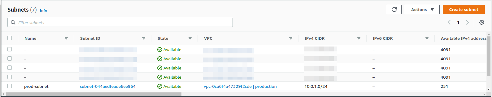

# Terraform Variable

Just like any other programming language, Terraform does allow us to make use of *`variable`* so that we can re-use values throughout our code without having to repeat ourselves.


Example:
```
# Virtual Private Cloud (VPC)
resource "aws_vpc" "prod-vpc" {
  cidr_block = "10.0.0.0/16"
  tags = {
    Name = "production"
  }
}

# Subnet
resource "aws_subnet" "subnet-1" {
  vpc_id     = aws_vpc.prod-vpc.id
  cidr_block = "10.0.1.0/24"
  availability_zone = "us-east-1a"

  tags = {
    Name = "prod-subnet"
  }
}
```

To define a variable in Terraform, all you have to do is just type in the `variable` and then the name of the variable.

Syntax:
```
variable "variable_name" {}
```

Within the variable definition, we can pass in three arguments or three parameters. All three of them are completely optional, and we can technically leave it empty. The three options are **description**, **default** value and **type**.

```
variable "subnet_prefix {
   description = "CIDR block for the subnet"
}
```

We can perform type constraints on variables so that when a user enters a value, we can make sure that they enter the proper type for this variable. So if we are expecting a string, we can say `type = string`. If you're not sure what type you need to be passed in, you can always just pass in `any` argument to say that we support any type.

To reference a variable, type in `var` and then the name of the variable. You can see that nowhere in the variable has actually defined the value of `subnet_prefix`, we just provided the description.

```
# Subnet
resource "aws_subnet" "subnet-1" {
  vpc_id     = aws_vpc.prod-vpc.id
  cidr_block = var.subnet_prefix
  availability_zone = "us-east-1a"

  tags = {
    Name = "prod-subnet"
  }
}
```

If we do a `terraform apply`, any variable that isn't assigned a value, Terraform will actually prompt the user to **Enter a value** for that. So enter in a value of `10.0.1.0/24`. So the value that we're passing in is going to get assigned to `subnet_prefix`. So once the AWS subnet resource runs, it is going to pull that value and store it for the `cidr_block`.

```bash
dev@dev:~$ terraform apply
var.subnet_prefix
  CIDR block for the subnet

  Enter a value: 10.0.1.0/24

Terraform used the selected providers to generate the following execution plan. Resource actions are indicated with the following symbols:
  + create

Terraform will perform the following actions:

  # aws_subnet.subnet-1 will be created
  + resource "aws_subnet" "subnet-1" {
      + arn                                            = (known after apply)
      + assign_ipv6_address_on_creation                = false
      + availability_zone                              = "us-east-1a"
      + availability_zone_id                           = (known after apply)
      + cidr_block                                     = "10.0.1.0/24"
      + enable_dns64                                   = false
      + enable_resource_name_dns_a_record_on_launch    = false
      + enable_resource_name_dns_aaaa_record_on_launch = false
      + id                                             = (known after apply)
      + ipv6_cidr_block_association_id                 = (known after apply)
      + ipv6_native                                    = false
      + map_public_ip_on_launch                        = false
      + owner_id                                       = (known after apply)
      + private_dns_hostname_type_on_launch            = (known after apply)
      + tags                                           = {
          + "Name" = "prod-subnet"
        }
      + tags_all                                       = {
          + "Name" = "prod-subnet"
        }
      + vpc_id                                         = (known after apply)
    }

  # aws_vpc.prod-vpc will be created
  + resource "aws_vpc" "prod-vpc" {
      + arn                                  = (known after apply)
      + cidr_block                           = "10.0.0.0/16"
      + default_network_acl_id               = (known after apply)
      + default_route_table_id               = (known after apply)
      + default_security_group_id            = (known after apply)
      + dhcp_options_id                      = (known after apply)
      + enable_classiclink                   = (known after apply)
      + enable_classiclink_dns_support       = (known after apply)
      + enable_dns_hostnames                 = (known after apply)
      + enable_dns_support                   = true
      + id                                   = (known after apply)
      + instance_tenancy                     = "default"
      + ipv6_association_id                  = (known after apply)
      + ipv6_cidr_block                      = (known after apply)
      + ipv6_cidr_block_network_border_group = (known after apply)
      + main_route_table_id                  = (known after apply)
      + owner_id                             = (known after apply)
      + tags                                 = {
          + "Name" = "production"
        }
      + tags_all                             = {
          + "Name" = "production"
        }
    }

Plan: 2 to add, 0 to change, 0 to destroy.

Do you want to perform these actions?
  Terraform will perform the actions described above.
  Only 'yes' will be accepted to approve.

  Enter a value: yes

aws_vpc.prod-vpc: Creating...
aws_vpc.prod-vpc: Creation complete after 4s [id=vpc-0ca6f4a47329f2cde]
aws_subnet.subnet-1: Creating...
aws_subnet.subnet-1: Creation complete after 1s [id=subnet-044aedfeade6ee964]

Apply complete! Resources: 2 added, 0 changed, 0 destroyed.
```

Take a look at the **AWS Console VPC Subnets** and you can see that it got passed in a `10.0.1.0/24`. That just confirms that our variable is working.



There are other ways of passing in values or assigning values to variables. One of those is through a command line argument. First, do a `terraform destroy` so we can delete those resources. It gonna prompt the user to **Enter a value** again, so enter a value of `10.0.1.0/24` or just leave it empty. It doesn't matter. Technically you can just leave   it blank and it should be able to destroy things just fine. We only really care about passing in the proper value when we're doing a `terraform apply`.

```bash
dev@dev:~$ terraform destroy --auto-approve
var.subnet_prefix
  CIDR block for the subnet

  Enter a value: 10.0.1.0/24

aws_vpc.prod-vpc: Refreshing state... [id=vpc-0ca6f4a47329f2cde]
aws_subnet.subnet-1: Refreshing state... [id=subnet-044aedfeade6ee964]

Terraform used the selected providers to generate the following execution plan. Resource actions are indicated with the following symbols:
  - destroy

Terraform will perform the following actions:

  # aws_subnet.subnet-1 will be destroyed
  - resource "aws_subnet" "subnet-1" {
      - arn                                            = "arn:aws:ec2:us-east-1:xxxxxxxxxxxxx:subnet/subnet-044aedfeade6ee964" -> null
      - assign_ipv6_address_on_creation                = false -> null
      - availability_zone                              = "us-east-1a" -> null
      - availability_zone_id                           = "use1-az2" -> null
      - cidr_block                                     = "10.0.1.0/24" -> null
      - enable_dns64                                   = false -> null
      - enable_resource_name_dns_a_record_on_launch    = false -> null
      - enable_resource_name_dns_aaaa_record_on_launch = false -> null
      - id                                             = "subnet-044aedfeade6ee964" -> null
      - ipv6_native                                    = false -> null
      - map_customer_owned_ip_on_launch                = false -> null
      - map_public_ip_on_launch                        = false -> null
      - owner_id                                       = "xxxxxxxxxxxxx" -> null
      - private_dns_hostname_type_on_launch            = "ip-name" -> null
      - tags                                           = {
          - "Name" = "prod-subnet"
        } -> null
      - tags_all                                       = {
          - "Name" = "prod-subnet"
        } -> null
      - vpc_id                                         = "vpc-0ca6f4a47329f2cde" -> null
    }

  # aws_vpc.prod-vpc will be destroyed
  - resource "aws_vpc" "prod-vpc" {
      - arn                              = "arn:aws:ec2:us-east-1:xxxxxxxxxxxxx:vpc/vpc-0ca6f4a47329f2cde" -> null
      - assign_generated_ipv6_cidr_block = false -> null
      - cidr_block                       = "10.0.0.0/16" -> null
      - default_network_acl_id           = "acl-0dc12d3d45ca678ac" -> null
      - default_route_table_id           = "rtb-012ea34f56f78908c" -> null
      - default_security_group_id        = "sg-0c123f4d5678a9cde" -> null
      - dhcp_options_id                  = "dopt-0a12da345cd6f8d69" -> null
      - enable_classiclink               = false -> null
      - enable_classiclink_dns_support   = false -> null
      - enable_dns_hostnames             = false -> null
      - enable_dns_support               = true -> null
      - id                               = "vpc-0ca6f4a47329f2cde" -> null
      - instance_tenancy                 = "default" -> null
      - ipv6_netmask_length              = 0 -> null
      - main_route_table_id              = "rtb-012ea34f56f78908c" -> null
      - owner_id                         = "xxxxxxxxxxxxx" -> null
      - tags                             = {
          - "Name" = "production"
        } -> null
      - tags_all                         = {
          - "Name" = "production"
        } -> null
    }

Plan: 0 to add, 0 to change, 2 to destroy.
yaws_subnet.subnet-1: Destroying... [id=subnet-044aedfeade6ee964]
aws_subnet.subnet-1: Destruction complete after 1s
aws_vpc.prod-vpc: Destroying... [id=vpc-0ca6f4a47329f2cde]
aws_vpc.prod-vpc: Destruction complete after 2s

Destroy complete! Resources: 2 destroyed.
```

If we are going to do a `terraform apply`, we can also do a `-var` and set a value for a variable.

```bash
dev@dev:~$ terraform apply -var "subnet_prefix=10.0.1.0/24"
Terraform used the selected providers to generate the following execution plan. Resource actions are indicated with the following symbols:
  + create

Terraform will perform the following actions:

  # aws_subnet.subnet-1 will be created
  + resource "aws_subnet" "subnet-1" {
      + arn                                            = (known after apply)
      + assign_ipv6_address_on_creation                = false
      + availability_zone                              = "us-east-1a"
      + availability_zone_id                           = (known after apply)
      + cidr_block                                     = "10.0.1.0/24"
      + enable_dns64                                   = false
      + enable_resource_name_dns_a_record_on_launch    = false
      + enable_resource_name_dns_aaaa_record_on_launch = false
      + id                                             = (known after apply)
      + ipv6_cidr_block_association_id                 = (known after apply)
      + ipv6_native                                    = false
      + map_public_ip_on_launch                        = false
      + owner_id                                       = (known after apply)
      + private_dns_hostname_type_on_launch            = (known after apply)
      + tags                                           = {
          + "Name" = "prod-subnet"
        }
      + tags_all                                       = {
          + "Name" = "prod-subnet"
        }
      + vpc_id                                         = (known after apply)
    }

  # aws_vpc.prod-vpc will be created
  + resource "aws_vpc" "prod-vpc" {
      + arn                                  = (known after apply)
      + cidr_block                           = "10.0.0.0/16"
      + default_network_acl_id               = (known after apply)
      + default_route_table_id               = (known after apply)
      + default_security_group_id            = (known after apply)
      + dhcp_options_id                      = (known after apply)
      + enable_classiclink                   = (known after apply)
      + enable_classiclink_dns_support       = (known after apply)
      + enable_dns_hostnames                 = (known after apply)
      + enable_dns_support                   = true
      + id                                   = (known after apply)
      + instance_tenancy                     = "default"
      + ipv6_association_id                  = (known after apply)
      + ipv6_cidr_block                      = (known after apply)
      + ipv6_cidr_block_network_border_group = (known after apply)
      + main_route_table_id                  = (known after apply)
      + owner_id                             = (known after apply)
      + tags                                 = {
          + "Name" = "production"
        }
      + tags_all                             = {
          + "Name" = "production"
        }
    }

Plan: 2 to add, 0 to change, 0 to destroy.

Do you want to perform these actions?
  Terraform will perform the actions described above.
  Only 'yes' will be accepted to approve.

  Enter a value: yes

aws_vpc.prod-vpc: Creating...
aws_vpc.prod-vpc: Creation complete after 5s [id=vpc-0012345f6c7e86f9c]
aws_subnet.subnet-1: Creating...
aws_subnet.subnet-1: Creation complete after 2s [id=subnet-0f12a3456bedd7e89]
```

Now, when you check on your AWS Console VPC Subnet, you'll get the `10.0.1.0/24` subnet CIDR block. So the variable assignment that got assigned on the command line argument worked.

The best way to do it is to create a separate file to assign variables and Terraform automatically looks for a file called `terraform.tfvars` for variable assignment and in that file we can define a value for that variable.

```
subnet_prefix = "10.0.200.0/24"
```

Do a `terraform apply` without passing in an argument. Now, because we've defined the variable, it should not prompt us for a value for the `subnet_prefix` variable.

```bash
dev@dev:~$ terraform apply
aws_vpc.prod-vpc: Refreshing state... [id=vpc-02ac0c451e07398e7]
aws_subnet.subnet-1: Refreshing state... [id=subnet-012c0fb3fa45678e9]

Terraform used the selected providers to generate the following execution plan. Resource actions are indicated with the following symbols:
-/+ destroy and then create replacement

Terraform will perform the following actions:

  # aws_subnet.subnet-1 must be replaced
-/+ resource "aws_subnet" "subnet-1" {
      ~ arn                                            = "arn:aws:ec2:us-east-1:xxxxxxxxxxxxx:subnet/subnet-012c0fb3fa45678e9" -> (known after apply)
      ~ availability_zone_id                           = "use1-az2" -> (known after apply)
      ~ cidr_block                                     = "10.0.1.0/24" -> "10.0.200.0/24" # forces replacement
      ~ id                                             = "subnet-012c0fb3fa45678e9" -> (known after apply)
      + ipv6_cidr_block_association_id                 = (known after apply)
      - map_customer_owned_ip_on_launch                = false -> null
      ~ owner_id                                       = "xxxxxxxxxxxxx" -> (known after apply)
      ~ private_dns_hostname_type_on_launch            = "ip-name" -> (known after apply)
        tags                                           = {
            "Name" = "prod-subnet"
        }
        # (9 unchanged attributes hidden)
    }

Plan: 1 to add, 0 to change, 1 to destroy.

Do you want to perform these actions?
  Terraform will perform the actions described above.
  Only 'yes' will be accepted to approve.

  Enter a value: yes

aws_subnet.subnet-1: Destroying... [id=subnet-012c0fb3fa45678e9]
aws_subnet.subnet-1: Destruction complete after 1s
aws_subnet.subnet-1: Creating...
aws_subnet.subnet-1: Creation complete after 2s [id=subnet-123456c0f6fe7a7df]

Apply complete! Resources: 1 added, 0 changed, 1 destroyed.
```

Take a look at the value and now it is set to `10.0.200.0/24`. So those are the three different methods for assigning variables. Technically we can also use environment variables from your operating system.


But what if you wanted it on a specific file name? We can do that by passing a flag `-var-file` to look for that file.

```bash
dev@dev:~$ terraform apply -var-file filename.tfvars
```

You will not get prompted to enter a value for that variable because Terraform was able to look at the `filename.tfvars` file and find that value. One another option to pass into a variable assignment is a `default` value. So this **`default`** value can be used if the user doesn't input a specific value.

```
variable "subnet_prefix" {
   description = "CIDR block for the subnet"
   default = "10.0.66.0/24"
}
```

---
**NOTE**

Remove the content of `terraform.tfvars` and run the command `terrafom destroy` before doing the `terraform apply`.

---

If the user doesn't input a variable assignment, then Terraform will automatically assign this variable to the `10.0.66.0/24` value. Even without having a value assigned to that variable, you can see that it still run and if you go the AWS Console VPC Subnets, take a look of the `Prod-subnet`, you can see that `10.0.66.0/24` has been assigned to it. So this is a way to apply a default value for a variable.

For the type constraints, in this case, the `cidr_block` of a subnet needs to be a string. So we don't want to receive a variable of any other type than string. What we can do is, add `type` that is equal to a `string`.

```
variable "subnet_prefix" {
  description = "CIDR block for the subnet"
  type        = string
}
```

If you try to assign `subnet_prefix` value as type list and try to run the `terraform apply`.

```
subnet_prefix = ["10.0.200.0/24"]
```

It will throw an error that says *Invalid value for input variable* because it checks to see if it is a string and it sees that it is not a string. This is just another way to make sure, especially when you are working on a large code base, and you are sharing your code with other developers, this will just make sure that they don't accidentally input a wrong variable type into a variable and potentially see an error when they run the config. It is just another sanity check that you can do.

```bash
dev@dev:~$ terraform apply
╷
│ Error: Invalid value for input variable
│ 
│   on terraform.tfvars line 1:
│    1: subnet_prefix = ["10.0.200.0/24"]
│ 
│ The given value is not suitable for var.subnet_prefix declared at main.tf:6,1-25: string required.
│
```

Now, we are going to create another subnet called `subnet-2` and we will try to reference a string list. On `terraform.tfvars` add the following:

```
subnet_prefix = ["10.0.200.0/24", "10.0.2.0/24"]
```

And on the `main.tf` add a new subnet resource block.

```
resource "aws_subnet" "subnet-2" {
  vpc_id            = aws_vpc.prod-vpc.id
  cidr_block        = var.subnet_prefix
  availability_zone = "us-east-1a"

  tags = {
    Name = "dev-subnet"
  }
}
```

To reference the list, the first object can be referenced with a zero and the second one will be referenced with a value of one, and so on.

```
resource "aws_subnet" "subnet-1" {
   ....
   cidr_block        = var.subnet_prefix[0]
   ....
}

resource "aws_subnet" "subnet-2" {
   ....
   cidr_block        = var.subnet_prefix[1]
   ....
}
```

We can have a list of objects too. Let us update the `terraform.tfvars` file and add an object of `cidr_block` and `name` for the tag name.

```
subnet_prefix = [
  {
    cidr_block = "10.0.1.0/24"
    name       = "prod_subnet"
  },
  {
    cidr_block = "10.0.2.0/24"
    name       = "dev_subnet"
  }
]
```

And don't forget to update the `main.tf` file for `subnet-1` and `subnet-2`.

```
resource "aws_subnet" "subnet-1" {
   ...
   cidr_block        = var.subnet_prefix[0].cidr_block
   
   tags = {
      Name = var.subnet_prefix[0].name
   }
}

resource "aws_subnet" "subnet-2" {
   ...
   cidr_block        = var.subnet_prefix[1].cidr_block
   
   tags = {
      Name = var.subnet_prefix[1].name
   }
}
```

And there you have it, you were able to now use a variable which is a list of objects to assign values within our Terraform configuration file. So there's a lot of flexibility with variables, you want to make use of them for as much as possible so that you're not re-typing the same thing over and over across large configs.

Keep in mind, that we define a variable on `main.tf` file but we have to assign the value in the `terraform.tfvars`.

## Arguments
* **default** is a default value which then makes the variable optional
* **type** specifies what value types are accepted for the variable
* **description** specifies the input variable's documentation

### Default values
The variable declaration can also include a `default` argument. If present, the variable is considered to be *optional* and the default value will be used if no value is set when calling the module or running Terraform.

### Type Constraints
The `type` argument in a `variable` block allows you to restrict the [type of value](https://www.terraform.io/language/expressions/types) that will be accepted as the value for a variable. If no type constraint is set then a value of any type is accepted.

Supported type keywords are:
* `string`
* `number`
* `bool`

## `terraform.tfvars` vs `variables.tf`
These two files are similar but are not the same. A **`variables.tf`** file is used to define the type of the variable and optionally set a default value. A terraform.tfvars file is used to set the actual values of the variables. The distinction between them is that of declaration and assignment. The variable block doesn't need to be present in `variables.tf` file. It can be present in any `tf` file. The function of the variable block is to let Terraform be aware of the existence of this variable.

**`terraform.tfvars`**
```
instance_type = "t2.micro"
```

**`variables.tf`**
```
variable "instance_type" {
   type        = "string"
   default     = "t2.micro"
   description = "EC2 instance type"
}
```

## Reference
* [Input Variables](https://www.terraform.io/language/values/variables)
* [What is the difference between variables.tf and terraform.tfvars?](https://medium.com/@subrata.das/what-is-the-difference-between-variables-tf-and-terraform-tfvars-132f8d0d606a)