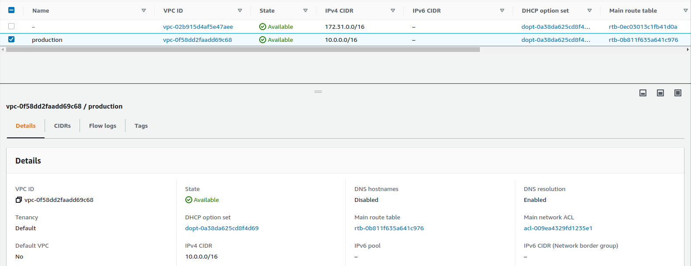
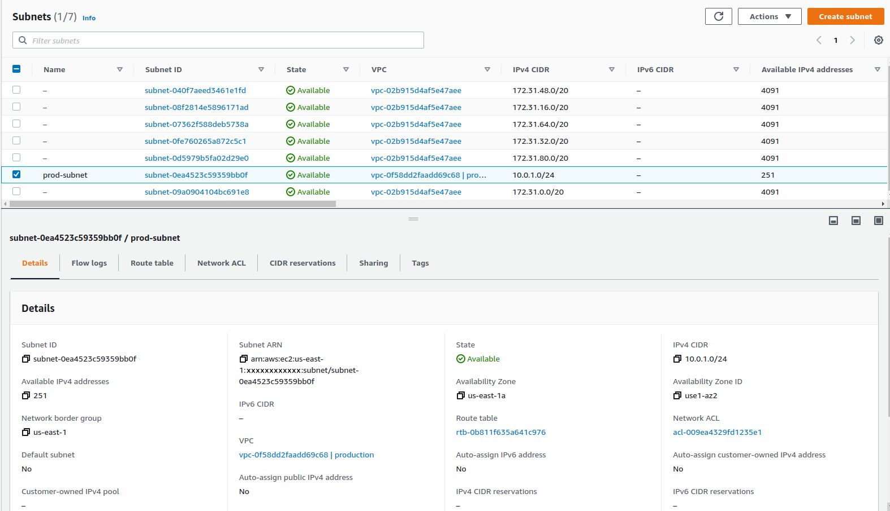

# Subnet within new VPC

## VPC
VPC stands for Virtual Private Cloud. It is a private, isolated network, within your AWS environment where you can create as many VPCs as you want, or there may be a limit, but you can have a lot of VPCs, and then each one of these VPCs by default, is going to be isolated from one another.

## `terraform init`

```bash
dev@dev:~$ terraform init

Initializing the backend...

Initializing provider plugins...
- Finding latest version of hashicorp/aws...
- Installing hashicorp/aws v4.25.0...
- Installed hashicorp/aws v4.25.0 (signed by HashiCorp)

Terraform has created a lock file .terraform.lock.hcl to record the provider
selections it made above. Include this file in your version control repository
so that Terraform can guarantee to make the same selections by default when
you run "terraform init" in the future.

Terraform has been successfully initialized!

You may now begin working with Terraform. Try running "terraform plan" to see
any changes that are required for your infrastructure. All Terraform commands
should now work.

If you ever set or change modules or backend configuration for Terraform,
rerun this command to reinitialize your working directory. If you forget, other
commands will detect it and remind you to do so if necessary.
```

## `terraform apply`

```bash
dev@dev:~$ terraform apply
Terraform used the selected providers to generate the following execution plan. Resource actions are indicated with the following symbols:
  + create

Terraform will perform the following actions:

  # aws_subnet.subnet-1 will be created
  + resource "aws_subnet" "subnet-1" {
      + arn                                            = (known after apply)
      + assign_ipv6_address_on_creation                = false
      + availability_zone                              = (known after apply)
      + availability_zone_id                           = (known after apply)
      + cidr_block                                     = "10.0.1.0/24"
      + enable_dns64                                   = false
      + enable_resource_name_dns_a_record_on_launch    = false
      + enable_resource_name_dns_aaaa_record_on_launch = false
      + id                                             = (known after apply)
      + ipv6_cidr_block_association_id                 = (known after apply)
      + ipv6_native                                    = false
      + map_public_ip_on_launch                        = false
      + owner_id                                       = (known after apply)
      + private_dns_hostname_type_on_launch            = (known after apply)
      + tags                                           = {
          + "Name" = "prod-subnet"
        }
      + tags_all                                       = {
          + "Name" = "prod-subnet"
        }
      + vpc_id                                         = (known after apply)
    }

  # aws_vpc.main-vpc will be created
  + resource "aws_vpc" "main-vpc" {
      + arn                                  = (known after apply)
      + cidr_block                           = "10.0.0.0/16"
      + default_network_acl_id               = (known after apply)
      + default_route_table_id               = (known after apply)
      + default_security_group_id            = (known after apply)
      + dhcp_options_id                      = (known after apply)
      + enable_classiclink                   = (known after apply)
      + enable_classiclink_dns_support       = (known after apply)
      + enable_dns_hostnames                 = (known after apply)
      + enable_dns_support                   = true
      + id                                   = (known after apply)
      + instance_tenancy                     = "default"
      + ipv6_association_id                  = (known after apply)
      + ipv6_cidr_block                      = (known after apply)
      + ipv6_cidr_block_network_border_group = (known after apply)
      + main_route_table_id                  = (known after apply)
      + owner_id                             = (known after apply)
      + tags                                 = {
          + "Name" = "production"
        }
      + tags_all                             = {
          + "Name" = "production"
        }
    }

Plan: 2 to add, 0 to change, 0 to destroy.

Do you want to perform these actions?
  Terraform will perform the actions described above.
  Only 'yes' will be accepted to approve.

  Enter a value: yes

aws_vpc.main-vpc: Creating...
aws_vpc.main-vpc: Creation complete after 3s [id=vpc-0f58dd2faadd69c68]
aws_subnet.subnet-1: Creating...
aws_subnet.subnet-1: Creation complete after 1s [id=subnet-0ea4523c59359bb0f]

Apply complete! Resources: 2 added, 0 changed, 0 destroyed.
```

You can see by default that there's a default VPC for every user, so that is the default VPC that gets created. If we take a look at the details, we've got the CIDR block that we assigned to it.



If we go to **Subnets**, there's going to be a whole bunch of subnets, but once again, these are all part of the default VPC that gets created. We'll see that the VPC that this subnet resides in is the VPC we created earlier within the Terraform, which is the production VPC. We also have the CIDR block.



Since when we create the subnet and we're referencing the VPC, the VPC resource has to get declared first. Actually, it does not need to be defined first. Let's try to put the VPC beneath the subnet.

```
resource "aws_subnet" "subnet-1" {
   vpc_id = aws_vpc.main-vpc.id
   cidr_block = "10.0.1.0/24"
   tags = {
      Name = "prod-subnet"
   }
}

resource "aws_vpc" "main-vpc" {
   cidr_block = "10.0.0.0/16"
   tags = {
      Name = "production"
   }
}
```

Now, within the code, we're defining the subnet, and we're referencing the VPC, even though the VPC is defined beneath it. The order in which you place your code does not matter within Terraform, which is a little confusing. If you're familiar with programming, it always follows a sequential order, starting from the top and working to the bottom.

If you get tired of having to hit `yes` whenever you want to create or destroy something, you can always do the `terraform apply --auto-approve` and that is going to skip that step.

```bash
dev@dev:~$ terraform apply --auto-approve

Terraform used the selected providers to generate the following execution plan. Resource actions are indicated with the following symbols:
  + create

Terraform will perform the following actions:

  # aws_subnet.subnet-1 will be created
  + resource "aws_subnet" "subnet-1" {
      + arn                                            = (known after apply)
      + assign_ipv6_address_on_creation                = false
      + availability_zone                              = (known after apply)
      + availability_zone_id                           = (known after apply)
      + cidr_block                                     = "10.0.1.0/24"
      + enable_dns64                                   = false
      + enable_resource_name_dns_a_record_on_launch    = false
      + enable_resource_name_dns_aaaa_record_on_launch = false
      + id                                             = (known after apply)
      + ipv6_cidr_block_association_id                 = (known after apply)
      + ipv6_native                                    = false
      + map_public_ip_on_launch                        = false
      + owner_id                                       = (known after apply)
      + private_dns_hostname_type_on_launch            = (known after apply)
      + tags                                           = {
          + "Name" = "prod-subnet"
        }
      + tags_all                                       = {
          + "Name" = "prod-subnet"
        }
      + vpc_id                                         = (known after apply)
    }

  # aws_vpc.main-vpc will be created
  + resource "aws_vpc" "main-vpc" {
      + arn                                  = (known after apply)
      + cidr_block                           = "10.0.0.0/16"
      + default_network_acl_id               = (known after apply)
      + default_route_table_id               = (known after apply)
      + default_security_group_id            = (known after apply)
      + dhcp_options_id                      = (known after apply)
      + enable_classiclink                   = (known after apply)
      + enable_classiclink_dns_support       = (known after apply)
      + enable_dns_hostnames                 = (known after apply)
      + enable_dns_support                   = true
      + id                                   = (known after apply)
      + instance_tenancy                     = "default"
      + ipv6_association_id                  = (known after apply)
      + ipv6_cidr_block                      = (known after apply)
      + ipv6_cidr_block_network_border_group = (known after apply)
      + main_route_table_id                  = (known after apply)
      + owner_id                             = (known after apply)
      + tags                                 = {
          + "Name" = "production"
        }
      + tags_all                             = {
          + "Name" = "production"
        }
    }

Plan: 2 to add, 0 to change, 0 to destroy.
aws_vpc.main-vpc: Creating...
aws_vpc.main-vpc: Creation complete after 3s [id=vpc-057a0a9acdeae9bc3]
aws_subnet.subnet-1: Creating...
aws_subnet.subnet-1: Creation complete after 1s [id=subnet-02c1432caf5d66602]

Apply complete! Resources: 2 added, 0 changed, 0 destroyed.
```

You can see here, that even though the subnet was declared first, Terraform created VPC first. They create and took three seconds to complete, and then the subnet is created. So Terraform does not care which order you define things because Terraform is intelligent enough to figure out what needs to get created first. Terraform knows that a subnet belongs in a VPC, and since this subnet is referencing the VPC, it knows to create the VPC first and then create the subnet. There are certain instances where it can't. However, if you look at the documentation, it will always tell you whenever Terraform can't figure out in what order to create things, it will give you a workaround. Like, usually you'll have to pass in an extra flag that says one resource depends on another but for the most part, Terraform will figure out everything for you.

## `terraform destroy`

```bash
dev@dev:~$ terraform destroy
aws_vpc.main-vpc: Refreshing state... [id=vpc-0f58dd2faadd69c68]
aws_subnet.subnet-1: Refreshing state... [id=subnet-0ea4523c59359bb0f]

Terraform used the selected providers to generate the following execution plan. Resource actions are indicated with the following symbols:
  - destroy

Terraform will perform the following actions:

  # aws_subnet.subnet-1 will be destroyed
  - resource "aws_subnet" "subnet-1" {
      - arn                                            = "arn:aws:ec2:us-east-1:xxxxxxxxxxxx:subnet/subnet-0ea4523c59359bb0f" -> null
      - assign_ipv6_address_on_creation                = false -> null
      - availability_zone                              = "us-east-1a" -> null
      - availability_zone_id                           = "use1-az2" -> null
      - cidr_block                                     = "10.0.1.0/24" -> null
      - enable_dns64                                   = false -> null
      - enable_resource_name_dns_a_record_on_launch    = false -> null
      - enable_resource_name_dns_aaaa_record_on_launch = false -> null
      - id                                             = "subnet-0ea4523c59359bb0f" -> null
      - ipv6_native                                    = false -> null
      - map_customer_owned_ip_on_launch                = false -> null
      - map_public_ip_on_launch                        = false -> null
      - owner_id                                       = "xxxxxxxxxxxx" -> null
      - private_dns_hostname_type_on_launch            = "ip-name" -> null
      - tags                                           = {
          - "Name" = "prod-subnet"
        } -> null
      - tags_all                                       = {
          - "Name" = "prod-subnet"
        } -> null
      - vpc_id                                         = "vpc-0f58dd2faadd69c68" -> null
    }

  # aws_vpc.main-vpc will be destroyed
  - resource "aws_vpc" "main-vpc" {
      - arn                              = "arn:aws:ec2:us-east-1:xxxxxxxxxxxx:vpc/vpc-0f58dd2faadd69c68" -> null
      - assign_generated_ipv6_cidr_block = false -> null
      - cidr_block                       = "10.0.0.0/16" -> null
      - default_network_acl_id           = "acl-009ea4329fd1235e1" -> null
      - default_route_table_id           = "rtb-0b811f635a641c976" -> null
      - default_security_group_id        = "sg-02d8741d8c94919b0" -> null
      - dhcp_options_id                  = "dopt-0a38da625cd8f4d69" -> null
      - enable_classiclink               = false -> null
      - enable_classiclink_dns_support   = false -> null
      - enable_dns_hostnames             = false -> null
      - enable_dns_support               = true -> null
      - id                               = "vpc-0f58dd2faadd69c68" -> null
      - instance_tenancy                 = "default" -> null
      - ipv6_netmask_length              = 0 -> null
      - main_route_table_id              = "rtb-0b811f635a641c976" -> null
      - owner_id                         = "xxxxxxxxxxxx" -> null
      - tags                             = {
          - "Name" = "production"
        } -> null
      - tags_all                         = {
          - "Name" = "production"
        } -> null
    }

Plan: 0 to add, 0 to change, 2 to destroy.

Do you really want to destroy all resources?
  Terraform will destroy all your managed infrastructure, as shown above.
  There is no undo. Only 'yes' will be accepted to confirm.

  Enter a value: yes

aws_subnet.subnet-1: Destroying... [id=subnet-0ea4523c59359bb0f]
aws_subnet.subnet-1: Destruction complete after 1s
aws_vpc.main-vpc: Destroying... [id=vpc-0f58dd2faadd69c68]
aws_vpc.main-vpc: Destruction complete after 1s

Destroy complete! Resources: 2 destroyed.
```

## Reference
* [`aws_vpc`](https://registry.terraform.io/providers/hashicorp/aws/latest/docs/resources/vpc)
* [`aws_subnet`](https://registry.terraform.io/providers/hashicorp/aws/latest/docs/resources/subnet)
* [AWS Provider](https://registry.terraform.io/providers/hashicorp/aws/latest/docs)